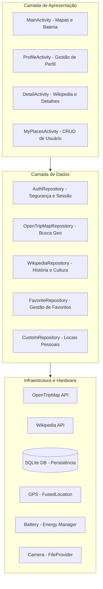
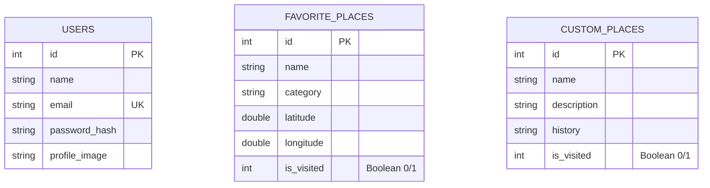

# 🗺️ RoraiTour: Guia Turístico Inteligente

O **RoraiTour** é uma plataforma Android robusta desenvolvida para exploração turística no estado de Roraima. O aplicativo combina dados de APIs globais, persistência local segura e integração profunda com hardware para oferecer uma experiência de viagem completa e offline-first.

---

## 🏗️ Arquitetura e Design Patterns

O projeto foi estruturado seguindo os princípios de **Clean Architecture** (adaptado) e **Repository Pattern**, garantindo que a lógica de interface (UI) seja totalmente independente da origem dos dados.

### Diagrama de Arquitetura

---

## 🛠️ Stack Tecnológica e Bibliotecas

| Componente | Tecnologia | Descrição |
| :--- | :--- | :--- |
| **Linguagem** | **Java 11** | Linguagem principal, garantindo estabilidade e compatibilidade. |
| **UI Engine** | **Material Design 3** | Componentes modernos para uma interface fluida e responsiva. |
| **Mapas** | **OSMDroid (6.1.20)** | Motor de mapas OpenStreetMap que permite cache offline e marcadores customizados. |
| **Rede** | **Retrofit 2 (2.11.0)** | Cliente HTTP type-safe para consumo assíncrono das APIs REST. |
| **JSON** | **GSON** | Serialização e desserialização automática de dados das APIs. |
| **Imagens** | **Glide** | Biblioteca de carregamento de imagens com sistema de cache em disco e memória. |
| **Localização** | **Google Play Services (Location)** | Uso do `FusedLocationProviderClient` para alta precisão com baixo consumo de energia. |
| **Banco de Dados** | **SQLite** | Armazenamento local robusto para usuários, favoritos e locais visitados. |
| **Hardware** | **BatteryManager & Camera** | Monitoramento de energia em tempo real e captura de fotos via `FileProvider`. |

---

## 🚀 Recursos Principais (RoraTodo)

### 1. Sistema de "Visitados" (Checklist)
O usuário pode gerenciar sua própria lista de locais turísticos. Cada local (seja da API ou criado pelo usuário) possui um **Checkbox de Visitado**, cujo estado é persistido no banco de dados local.

### 2. Integração com APIs Inteligentes
*   **OpenTripMap**: Localiza pontos turísticos num raio baseado na posição GPS do usuário.
*   **Wikipedia**: Busca automaticamente o resumo histórico e fotos de qualquer local selecionado, transformando o app em um guia cultural.

### 3. Hardware e Sensores em Tempo Real
*   **GPS e Distância**: O app captura a latitude/longitude do aparelho e calcula instantaneamente a distância em KM até o ponto turístico.
*   **Monitoramento Energético**: Exibe a porcentagem real da bateria no menu lateral, ideal para turistas em trilhas de longa duração.
*   **Câmera Integrada**: Permite capturar fotos de perfil ou de locais diretamente pelo app, usando permissões dinâmicas.

### 4. Segurança e Autenticação
*   **Hash SHA-256**: As senhas dos usuários nunca são salvas em texto puro; o app gera um hash de segurança antes da persistência no SQLite.
*   **Gestão de Sessão**: Uso de `SharedPreferences` para manter o usuário logado com segurança.

---

## 📂 Camada de Dados (Modelo ER)

---

## ✒️ Autores
- **Kaio Guilherme** - Desenvolvimento de Backend, APIs e Hardware Integration.
- **Wandressa Reis** - UI/UX Design e Persistência de Dados.
