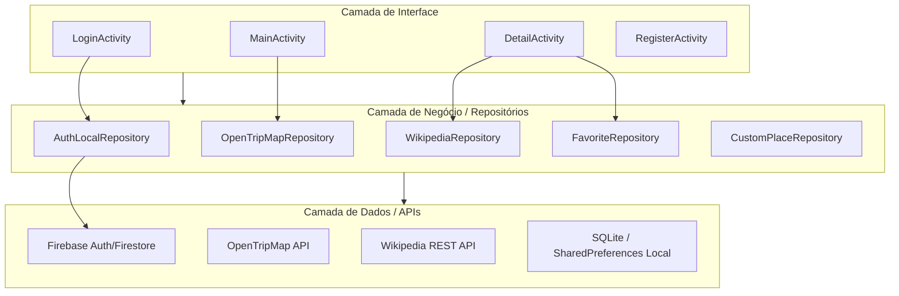

# 🗺️ RoraiTour - Seu Guia Turístico Digital

O **RoraiTour** é um aplicativo Android moderno desenvolvido para facilitar a descoberta de pontos turísticos, restaurantes, hotéis e locais históricos no estado de Roraima (e em qualquer lugar do mundo através de geolocalização). O app combina o poder do **Firebase**, **OpenTripMap** e **Wikipedia** para oferecer uma experiência rica em informações com um design limpo e intuitivo.

---

## 🎨 Design e Experiência do Usuário (UX/UI)
O aplicativo adota uma paleta de cores em **tons pastéis de azul**, focando na legibilidade e no conforto visual:
- **Tema Claro/Escuro (Day/Night)**: Suporte nativo para modo noturno com inversão inteligente de contraste.
- **Interface Imersiva**: Mapa em tela cheia com elementos de busca e navegação flutuantes.
- **Painéis Deslizantes (Bottom Sheets)**: Utilização de componentes Material Design 3 para exibição de listas sem perder o contexto do mapa.

---

## 🚀 Funcionalidades Principais
- **Autenticação Híbrida**: Login via E-mail/Senha e **Google Sign-In**.
- **Exploração Geoespacial**: Visualização de locais próximos em um mapa interativo (`OSMDroid`).
- **Busca Inteligente**: Pesquisa por categorias como "Restaurantes", "Hotéis", "Histórico" e "Natureza".
- **Detalhes Enriquecidos**: Informações históricas extraídas automaticamente da **Wikipedia**.
- **Favoritos**: Salve seus locais preferidos para acesso offline.
- **Gerenciamento de Locais**: Adicione seus próprios pontos turísticos personalizados com fotos e descrições.
- **Navegação**: Integração com Google Maps para traçar rotas até o destino selecionado.

---

## 🏗️ Arquitetura do Projeto
O projeto utiliza o padrão **Repository Pattern** em conjunto com a arquitetura baseada em **Activities** e **Models**, garantindo a separação de responsabilidades.

### Esquema da Arquitetura (Mermaid)

---

## 📁 Estrutura de Arquivos Principal

| Diretório/Arquivo | Descrição |
| :--- | :--- |
| `activities/` | Telas do sistema (Login, Home, Detalhes, Cadastro). |
| `adapters/` | Adaptadores para RecyclerView (Listas de locais e favoritos). |
| `models/ modelagem de dados (TouristPlace, User, etc). |
| `repositories/` | Lógica de acesso a dados (APIs e Banco Local). |
| `api/` | Configurações do Retrofit e interfaces das APIs externas. |
| `utils/` | Classes utilitárias (Carregamento de imagem, Conectividade, Configurações). |
| `res/layout/` | Arquivos XML de interface com design responsivo. |
| `res/values-night/` | Definições de cores para suporte ao Modo Escuro. |

---

## 🛠️ Tecnologias Utilizadas
- **Linguagem**: Java (Android SDK)
- **Banco de Dados**: Firebase Firestore & SQLite
- **APIs de Terceiros**: 
  - OpenTripMap (Dados geográficos)
  - Wikipedia (Descrições e Imagens)
- **Bibliotecas**:
  - `Retrofit 2` & `Gson` (Consumo de APIs)
  - `Glide 4` (Processamento e Cache de Imagens)
  - `OSMDroid` (Mapas OpenStreetMap)
  - `Google Play Services` (Localização e Auth)

---

## ⚙️ Como Configurar o Projeto

1. **Firebase**:
   - Crie um projeto no Console do Firebase.
   - Adicione seu arquivo `google-services.json` na pasta `/app`.
   - Certifique-se de registrar a chave **SHA-1** do seu ambiente nas configurações do projeto para habilitar o Google Sign-In.

2. **Chaves de API**:
   - Obtenha uma chave gratuita em [OpenTripMap](https://opentripmap.io/).
   - Insira sua chave no arquivo `src/main/java/com/example/roraitour/utils/AppConfig.java`.

3. **Compilação**:
   - Utilize o Android Studio para sincronizar o Gradle.
   - Execute o comando `./gradlew clean build` para garantir uma instalação limpa.

---

## ✒️ Autor
Desenvolvido por **Kaio Guilherme** como parte do projeto de Desenvolvimento Mobile - 8° Semestre.

---
*Este projeto foi otimizado para oferecer alta performance e baixo consumo de dados, utilizando técnicas de cache e carregamento assíncrono.*
