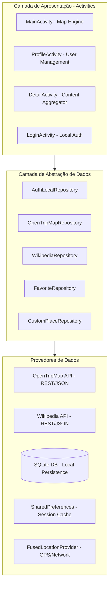
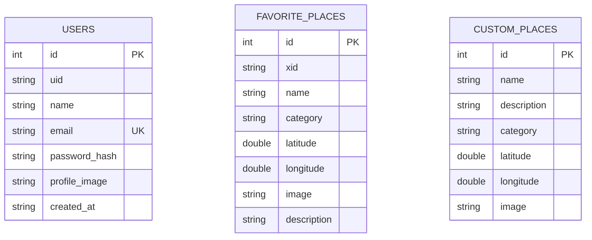

# 🗺️ Documentação Técnica: RoraiTour

O **RoraiTour** é uma plataforma Android de exploração turística que integra dados geoespaciais distribuídos para fornecer informações em tempo real sobre pontos de interesse. O sistema foi projetado para operar com alta performance, priorizando a privacidade do usuário através de persistência local e consumo otimizado de APIs REST.

---

## 🏗️ Arquitetura do Sistema

O projeto utiliza o padrão **Repository Pattern** desacoplado da camada de interface (**Activities**), garantindo manutenibilidade e facilidade de testes.

### Visão Geral da Arquitetura (Mermaid)



---

## 🛠️ Stack Tecnológica

| Tecnologia | Finalidade | Versão |
| :--- | :--- | :--- |
| **Java 11** | Linguagem de desenvolvimento principal. | - |
| **Android SDK** | Framework base (Target SDK 35). | 35 |
| **OSMDroid** | Motor de renderização de mapas OpenStreetMap. | 6.1.20 |
| **Retrofit 2** | Cliente HTTP type-safe para consumo de APIs. | 2.11.0 |
| **Glide 4** | Framework de carregamento e cache de mídia. | 4.16.0 |
| **SQLite** | Banco de dados relacional para dados persistentes. | 3 |
| **FusedLocation** | API do Google Play Services para geolocalização. | 21.3.0 |

---

## 📂 Camada de Persistência (Database)

O aplicativo utiliza um banco de dados **SQLite** local para garantir o funcionamento de funcionalidades críticas em ambientes offline.



---

## 📡 Integrações de API e Dados

### 1. Sistema de Mapas (OSMDroid)
Diferente do Google Maps tradicional, o RoraiTour utiliza **OSMDroid**, que permite:
- Renderização de *tiles* via OpenStreetMap (Mapnik).
- Cache local de mapas para redução de consumo de dados.
- Manipulação programática de sobreposições (*Overlays*) para marcadores dinâmicos.

### 2. Geolocalização
Implementado via `FusedLocationProviderClient`, utilizando uma estratégia de fusão entre GPS, Wi-Fi e redes móveis para determinar a posição com precisão sub-métrica e baixo impacto na bateria.

### 3. OpenTripMap API
Responsável pelo fornecimento de dados geo-referenciados:
- **Endpoints Utilizados**: Radius (busca por raio) e XID (detalhes específicos).
- **Filtros**: Implementação de `kinds` para categorização de locais (histórico, cultural, natural).

### 4. Wikipedia REST API
Utilizada como motor de conhecimento histórico:
- O app realiza chamadas assíncronas para buscar `extracts` (resumos) e `originalimage` baseando-se no nome do local retornado pelo OpenTripMap.

---

## 🔐 Fluxo de Autenticação e Segurança

O sistema de segurança não depende de servidores externos para validação de identidade:

1.  **Criptografia**: As senhas nunca são armazenadas em texto plano. É utilizado **SHA-256** para gerar o hash antes da gravação no SQLite.
2.  **Sessão**: Gerenciada via `AuthLocalRepository` que sincroniza o estado entre o banco de dados e `SharedPreferences` para acesso rápido durante o *Splash*.
3.  **Permissões de Mídia**: Utiliza `ACTION_OPEN_DOCUMENT` com `takePersistableUriPermission` para garantir que as fotos de perfil persistam mesmo após o reinício do sistema operacional.

---

## 🏗️ Estrutura de Pacotes

```text
com.example.roraitour
├── activities      # Controladores de interface (Activities/Context)
├── adapters        # Lógica de vinculação de dados para Listas (RecyclerView)
├── api             # Definições de interfaces Retrofit e modelos POJO de resposta
├── database        # Configuração do SQLite e DatabaseHelper
├── models          # Entidades de dados (Domain Objects)
├── repositories    # Camada de lógica de dados e regras de negócio
└── utils           # Classes auxiliares (ImageLoader, Network, Constants)
```

---

## ⚙️ Procedimentos de Build

1.  **Configuração de API**: Insira a chave do OpenTripMap no arquivo `AppConfig.java`.
2.  **Gradle**: Execute `./gradlew assembleDebug` para gerar o artefato de desenvolvimento.
3.  **Requisitos**: Dispositivo Android com API 26 (Android 8.0) ou superior.

---

## ✒️ Autores
- **Kaio Guilherme** - Desenvolvimento de Backend/API Integrations
- **Wandressa Reis** - UI/UX Design e Camada de Persistência Local
